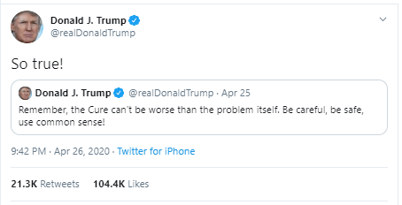

# Donald Trump's Influence during Covid: How bad can the Impact of a Leader's Communication be?

## Abstract :

Donald Trump’s many tweets during Covid spread like wildfire, probably making him one of the most influential figures during the pandemic. But was he truly so influential? Will causal analyses of the effect of Trump’s tweets on Google queries show that he was leading or following online trends? Also, does the topic or sentiment of his tweets influence their popularity? Conversely, can we show that Trump’s tweeting is rather a mirror of global trends or other exogenous factors? Our goal is to study the impact an influential leader can have on information spread in a crisis with a focus on fake news, as an overload of misleading or contradictory statements (an infodemic, as the [WHO](https://www.who.int/health-topics/infodemic#tab=tab_1) calls it) are known to have a detrimental impact on crisis management. Trump the Trend Maker or Trump the Follower, that is the question!

For a didactic presentation of our work, please check our [Data Story](https://mellopietro.github.io/adadakadavra-datastory/#topic=2&lambda=1&term=)!

## Research questions

- Was Donald Trump a trend maker or a follower: can we spot a correlation or even causality between his declarations and online trends, i.e. on Wikipedia or Google Trends page views?
- Do his tweets have a more significant impact on information spread when they convey fake news, or when they are negative?
- Can we predict Trump’s tweeting behavior as a function of exogenous factors, e.g. mobility restrictions or a rise in Covid cases?
    
## Proposed additional datasets

To conduct the analysis, we'll complete the given dataset with the following:

- Donald Trump's tweet between 2019 and
  2021: [Kaggle](https://www.kaggle.com/datasets/codebreaker619/donald-trump-tweets-dataset),
- Another dataset from Kaggle, giving this time a sample of 30 000 American tweets per day,
- List of known fake news and their Google trends'
  reference : [GitHub](https://github.com/epfl-dlab/fact-checkers-fact-check/blob/main/data/kg_ids.json),
- Data extracted from Google Trends and Wikipedia,
- Evolution of the number of new cases, from [Kaggle](https://www.kaggle.com/datasets/niketchauhan/covid-19-time-series-data?select=time-series-19-covid-combined.csv).

The first dataset is composed of Donald Trump tweets until 2021. It has very few
missing values and also includes information such as the number of likes and
retweets, and whether the tweet has been deleted or not (which could be an
indicator of fake information). Similarly, the second dataset gives a sample of tweets 
in the US. We only used the tweet content and its date in this dataset.
The third addition is a mapping between claim clusters and knowledge graph ids.
[Ribeiro et al.](https://arxiv.org/abs/2109.09322) regrouped fact-checks from a dataset provided by the IFCN into 39
clusters (e.g. with topic ‘alcohol’), which they matched with entities in Google
Knowledge Graph, allowing us to search time series associated with the claims on
Google Trends.
Next, we directly searched for pageviews time series for a few specific articles on
Wikipedia or queries on Google Trends to conduct a more fine-grained analysis of
information spread. This allowed us to track the evolution of pageviews for specific
topic such as hydroxychloroquine on Wikipedia for instance.
Finally, the last dataset was used to get time series of the number of new cases in the US.

## Method

The purpose of our analysis is to study the impact of Donald Trump’s tweets on the popularity of online content. To achieve this, we took the following steps:

1. **Contextualization**
    - We provided a context with plots showing the co-evolution of online traffic and mobility during the pandemic.
    - Online traffic was measured using Wikipedia page view statistics, and mobility was measured using Google mobility reports.

2. **Preliminary Analyses of Trump's Tweets**
    - Examined word frequency, evolution of tweet/retweet numbers during the pandemic, and Covid-related tweets.
    - Basic manipulation and plotting were performed using the dataset with Trump’s tweets.

3. **Topic Clustering with Latent Dirichlet Allocation (LDA)**
    - Clustered Trump’s tweets into topics using Latent Dirichlet Allocation.
    - Used [Gensim](https://radimrehurek.com/gensim/), an open-source library for natural language processing.

4. **Granger Causality Test**
    - Conducted a [Granger causality test](https://en.wikipedia.org/wiki/Granger_causality) between Trump’s tweets and the evolution of Wikipedia page views for the topic 'hydroxychloroquine'.
    - Used the statsmodels library for statistical analysis.

5. **Causal Impact Study**
    - Conducted a causal impact study of Trump’s Covid-related tweets on Google Trends queries, specifically for 'hydroxychloroquine'.
    - Used the [Causal Impact library](https://google.github.io/CausalImpact/CausalImpact.html).
    - Examined the impact of Trump’s tweets on Google Trends time series for both Covid-related and non-Covid-related topics.

6. **Sentiment Analysis with VADER**
    - Analyzed the sentiment of Trump’s tweets using [VADER](https://www.analyticsvidhya.com/blog/2021/06/vader-for-sentiment-analysis/), a rule-based sentiment analyzer for social media text.

7. **Linear Regression Model for Retweet Prediction**
    - Trained a linear regression model from the statsmodel library to predict the number of retweets as a function of sentiment and tweet topic.

8. **Logistic Regression Model for Sentiment Prediction**
    - Trained a logistic regression model to predict the sentiment of Trump’s tweets (negative/positive) based on the rise in the number of Covid cases and the overall sentiment of American tweets over the period of interest.

## Executed timeline
We organized our team in subgroups of 2 to 3 people working on parts of the
project. We meet twice a week to put our respective contributions to gather and
discuss our progress and future steps.
We propose a timeline structured in two-week intervals until late December (the
people assigned to the task are in italic):
- Nov 17, Milestone 2 submission;
- Dec 1, Discuss feedback from Milestone 2 and apply required changes to
existing notebook, gather a list of
topics/news/announcements/key Covid-related events to focus our analysis
on, learn the basics of website creation;
- Dec 15, Complete the analysis in the Notebook code with helpfer functions +
graphs, Make a first draft of the data story;
- Dec 22, Ask for final feedback, detail/clarify the explanations (in English) and
the comments in the Notebook and polish the data story website.

## Contributions
- Pietro : Set up the website and focused on the context plots
- Michel Angelo: Conducted Trump’s tweet analysis and LDA for topics
- Sabri: Focused on the causal analysis and the study of Granger causality
- Etienne: Focused on using the retweets to assess Trump’s influence, based on topics and sentiment analysis
- Matteo: Proposed to predict the sentiments of Trump’s tweet from external data, studied the evolution of sentiments over time

